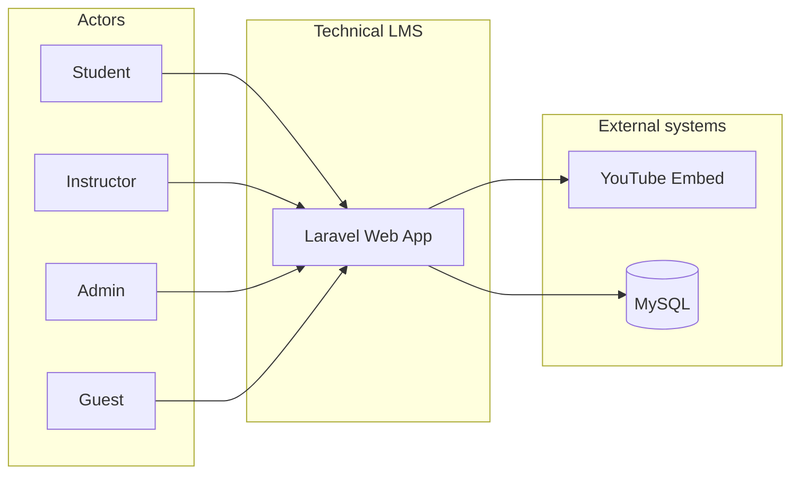
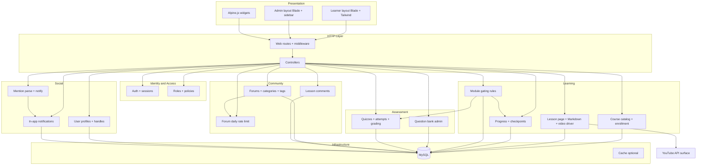

# Component diagram (logical)

High-level **logical components** of the Technical LMS monolith and their **dependencies**. Deployment is a **single Laravel application** (one deployable); components are **bounded contexts** inside the codebase.

**UI split (implementation):** learners and guests use the **learner shell** (course library, lessons, forums, auth). **Admins** use a **separate admin shell** (sidebar navigation under `/admin`) for CMS work. Both are Blade + Tailwind; they share routes/controllers and DB — only layouts and navigation differ.

---

## 1. System context (external actors)

---

## 2. Internal components and dependencies

**Notes:**

- **Learner vs admin:** `LearnUI` serves public and student flows; `AdminUI` serves `role:admin` routes only. Same **Controllers** behind both.
- **YouTube** is not a first-class “component” inside the repo; **LessonDelivery** uses **VideoDriver** (see domain class diagram) which calls out to YouTube embed (v1).
- **R2** appears later as another **VideoDriver** implementation; **LessonDelivery** stays stable.

---

## 3. Dependency direction (rules of thumb)

| From | To | Rationale |
|------|-----|-----------|
| Controllers | Domain services / actions | Thin HTTP layer |
| Gating | Progress + Quiz outcomes | Unlock uses completion state |
| Forums | RateLimit | Posts must pass limit before persist |
| Mentions | NotifInApp | Mentions create notification rows |
| All data components | MySQL | Single source of truth |

---

## 4. Optional future components (not v1)

- **Email / queue** for notifications.
- **Certificate generator** (PDF).
- **DRM / transcoding** pipeline for video.
