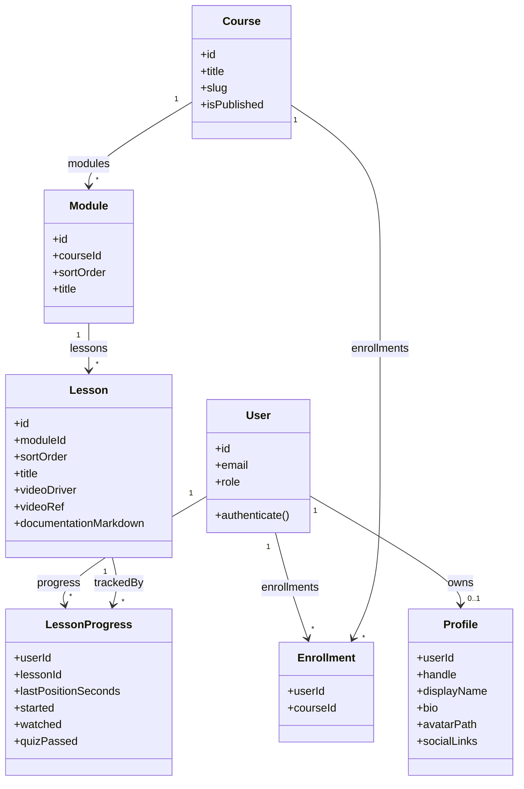
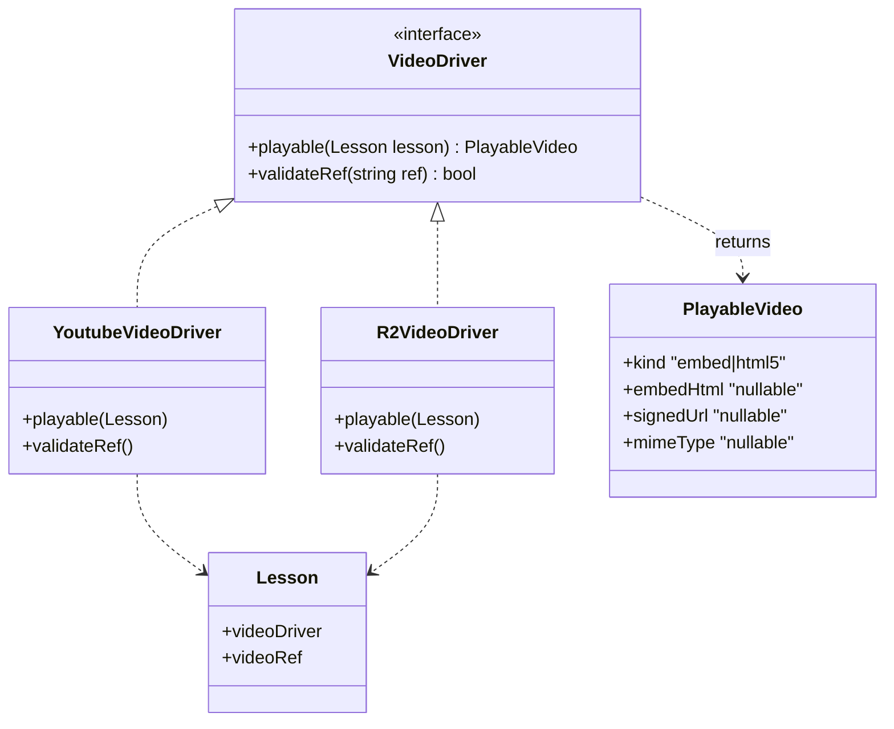
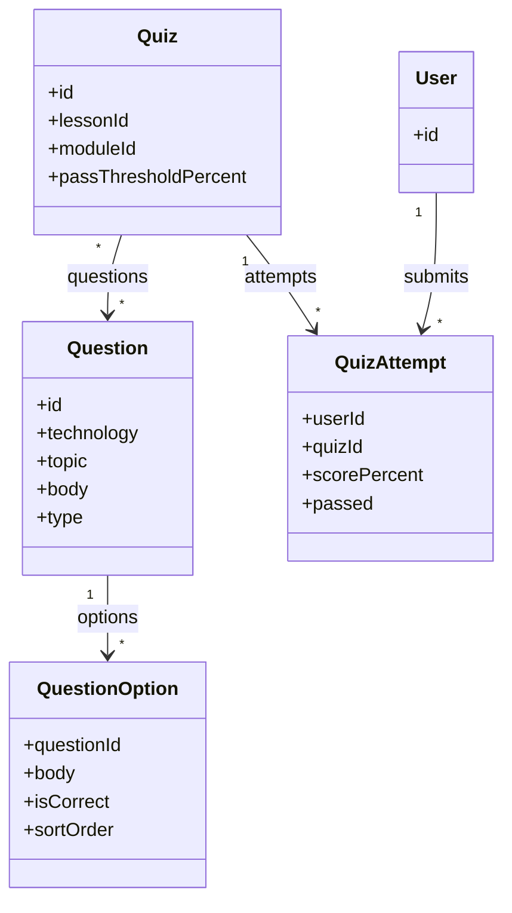
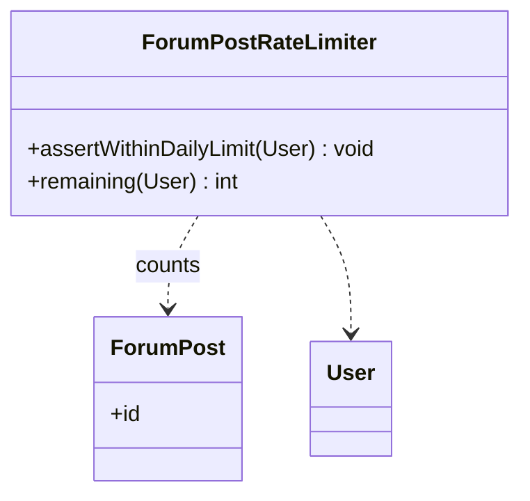

# Domain class diagram (logical)

This diagram shows **domain models** and **key application services**, not every Laravel class (no `Controller`, `Request`, `FormRequest` explosion). PHP/Laravel naming is illustrative.

**Scope:** Domain and services only — **not** learner vs admin **view** classes (those are Blade layouts under `resources/views/layouts/`).

---

## 1. Core learning domain



---

## 2. Video abstraction (switch YouTube ↔ R2)



- **Resolution:** A small factory reads `config` + `lesson.video_driver` and returns the correct driver.

---

## 3. Assessment domain



*(Association class `QuizQuestion` / pivot omitted above; use pivot table in DB.)*

---

## 4. Community and notifications

```mermaid
classDiagram
  class ForumCategory {
    +id
    +name
    +slug
  }
  class Tag {
    +id
    +name
    +slug
  }
  class ForumThread {
    +id
    +categoryId
    +userId
    +title
  }
  class ForumPost {
    +id
    +threadId
    +userId
    +body
  }
  class LessonComment {
    +lessonId
    +userId
    +parentId
    +body
  }
  class MentionParser {
    +extractHandles(string body) string[]
  }
  class NotificationDispatcher {
    +notifyMentionedUsers()
  }
  ForumCategory "1" --> "*" ForumThread
  ForumThread "1" --> "*" ForumPost
  ForumThread }o--o{ Tag : tags
  Lesson "1" --> "*" LessonComment
  MentionParser ..> NotificationDispatcher : triggers
  User "1" --> "*" ForumThread : creates
  User "1" --> "*" ForumPost : writes
```

---

## 5. Rate limiting (forum)



---

## Service vs model summary

| Layer | Responsibility |
|-------|------------------|
| **Eloquent models** | Persistence, relationships, casts |
| **VideoDriver** | Hide YouTube vs R2 details from views |
| **MentionParser + NotificationDispatcher** | Parse `@handle`, create Laravel `Notification` records |
| **ForumPostRateLimiter** | Enforce 5 forum posts / user / day |
| **Quiz grading** | Transactional scoring inside an action/service |
