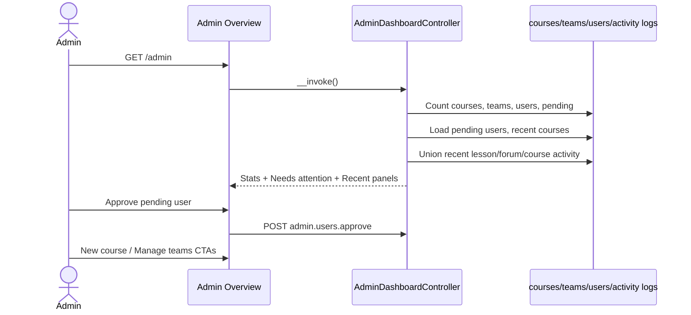

# Phase 1, Epic - Admin Dashboard Refactor

## Goal
Turn `/admin` into a useful ops home: live counts, pending approvals, recent courses, and recent activity. Keep the sidebar to destinations only (team-first label, no create actions in nav).

## Sequence

## Manual checklist

1. Sign in as admin and open `/admin`.
2. Confirm sidebar: Overview, Courses, **Teams**, Monitoring, Forum categories, Tags — no Question bank, no New course in nav.
3. Stat cards show Courses / Teams / Users / Pending with correct numbers.
4. Create an unapproved user; confirm they appear under **Needs attention** with Manage + Approve.
5. Approve from the dashboard; pending count drops.
6. Recent courses lists latest courses with Edit links.
7. Open a lesson as a learner; confirm Recent activity updates (or shows empty state cleanly).
8. **New course** CTA goes to create form; **Manage teams** opens Teams tab.
9. Courses page still has its own **New course** button.

## Out of scope
- Charts / deep analytics
- Team-to-course mapping
- Full CMS visual redesign
