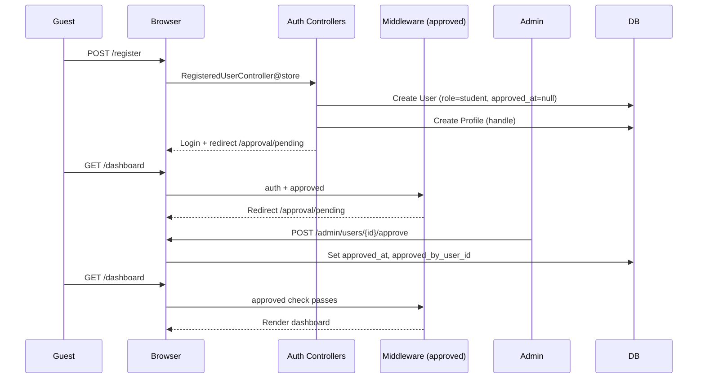

# Version 1, Epic 1 - Foundation & Admin Approval Sequence

## Purpose

Documents registration, login, approval gating, and role middleware for Protech LMS.

## Sequence Flow

## Manual QA

1. Register a new account at `/register`.
2. Confirm redirect to `/approval/pending` after registration.
3. Try `/dashboard` — should redirect to approval notice.
4. Log in as admin (`admin@gmail.com` / `password`).
5. Open `/admin/users`, approve the new user.
6. Log in as the new user — `/dashboard` should load.
7. Log out; confirm protected routes redirect guests to `/login`.

## Database Checks

- `users.role` = `student` for new registration.
- `users.approved_at` is NULL until admin approves.
- `profiles.handle` is unique and created on register.
- Admin user has `role = admin` and `approved_at` set.
