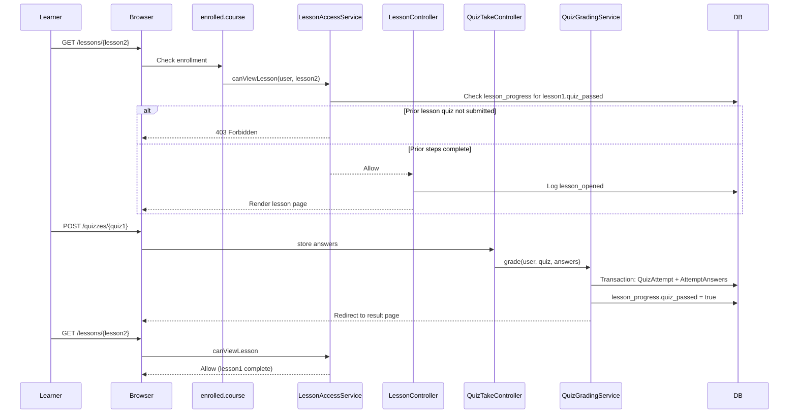

# Version 1, Epic 5 - Sequential Lesson Gating Sequence

## Purpose

Documents how lesson access, quiz submission, and progress unlocking work.

## Sequence Flow



## Gating Rules

1. Course order: modules by `sort_order`, lessons by `sort_order` within module.
2. Lesson 1: accessible when enrolled.
3. Lesson N: requires all lessons 0..N-1 have `lesson_progress.quiz_passed = true`.
4. Lesson without a lesson quiz: never completes → blocks downstream lessons.
5. Lesson quiz: any submission sets `quiz_passed = true` (no score threshold).
6. Module recap quiz: all module lessons complete first; `pass_threshold_percent` applies.

## Manual QA

1. Seed or create a course with 2+ lessons, each with a lesson quiz.
2. Enroll a test student via admin.
3. Open lesson 2 directly — expect 403 or locked state.
4. Complete lesson 1 quiz (submit any answers).
5. Confirm `lesson_progress.quiz_passed = 1` for lesson 1 in DB.
6. Open lesson 2 — should load.
7. Run `php artisan test --filter=LessonSequenceGatingTest`.

## Database Checks

```sql
-- After lesson 1 quiz submit
SELECT quiz_passed FROM lesson_progress
WHERE user_id = ? AND lesson_id = ?;
-- Expected: quiz_passed = 1

-- Quiz attempt recorded
SELECT score_percent, passed FROM quiz_attempts
WHERE user_id = ? AND quiz_id = ?;
```
