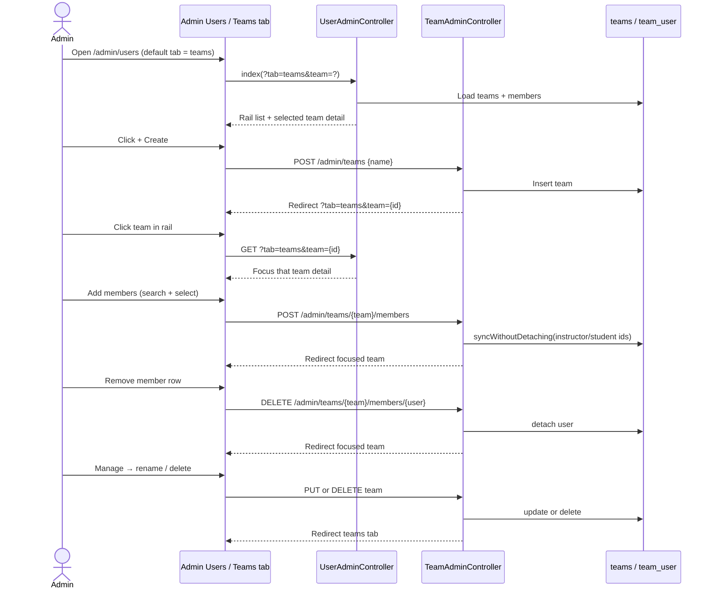

# Phase 1, Epic - Teams Admin UX (Teams-like layout)

## Goal
Make admin team management easier by mirroring Microsoft Teams interaction patterns: pick a team from a left rail, manage only that team in a detail pane, add members via search dialog, and remove members one at a time.

## Sequence

## Manual test checklist

1. Sign in as admin and open **Users**.
2. Confirm **Teams** is the default tab and shows a left team list + right detail panel (not stacked cards).
3. Click **+ Create**, enter a team name, submit — new team appears selected in the rail.
4. Open **Add members**, search an instructor and a student, add them — they appear in the Members list with role badges.
5. Use **Filter members** to narrow the list.
6. Click **Remove** on one member — they leave the team but remain in **All users**.
7. Use **Manage → Save name** to rename; confirm rail label updates.
8. Delete a team; confirm members still exist under **All users**.
9. Open **All users** and confirm each person’s Teams column still lists memberships.
10. Sign in as a non-admin and confirm team create/add/remove routes are forbidden.

## Notes
- Role still comes from the user account (Instructor / Student), not from the team pivot.
- Attach validates role fields (`instructor_ids` / `student_ids`) the same way as before.
- Commerce, course-to-team mapping, and learner-facing Teams UI remain out of scope for this epic.
