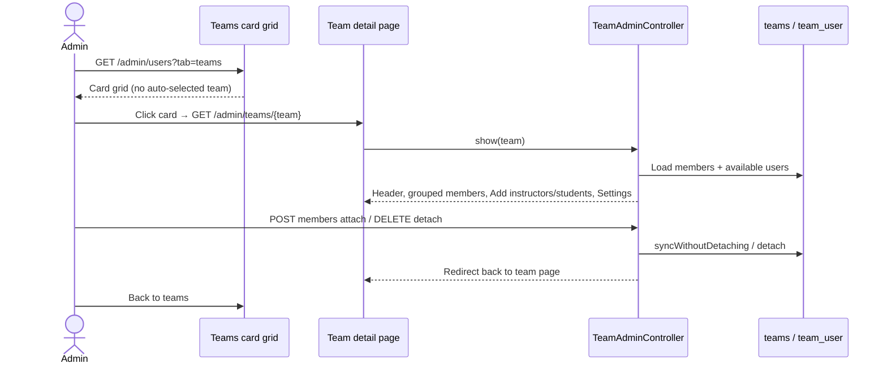

# Phase 1, Epic - Teams Detail UX

## Goal
Browse teams on a Microsoft Teams–style card grid, then open a dedicated full-page team detail for member management. Clicking a team must clearly change the screen.

## Sequence

## Manual checklist

1. Open **Teams** — see **Your teams** card grid (no disclosure triangle on menus).
2. Click a team card — whole page becomes that team’s detail.
3. Use **Add instructors** and **Add students** (separate buttons; dialog tabs always show both roles, even when empty).
4. Members list is grouped: Instructors then Students.
5. Filter members; Remove one member.
6. Rename / delete under **Settings** (not a floating Manage menu).
7. Create team from grid — lands on the new team’s detail page.
8. Dialogs are centered on the viewport via `.admin-dialog` (never under the sidebar). Card ··· opens a centered Team settings modal — not a side popover.

## Notes
- Role stays on the user account. Team page only assigns people to the team.
- If no instructors appear to add, create an Instructor account under **All users** first.

## Out of scope
- Chat / channels / files
- Team ↔ course mapping
- Changing role from the team page
