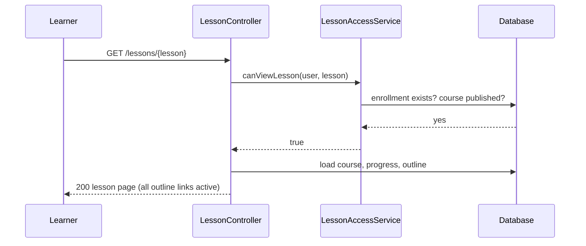
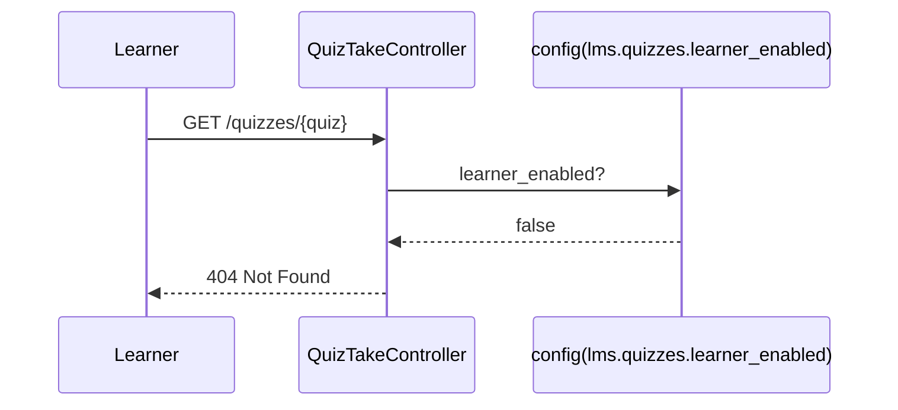
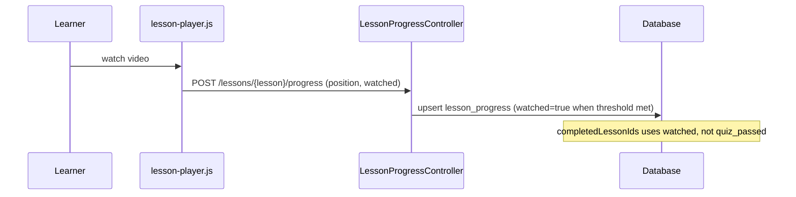

# Phase 3, Epic 1 - Decouple Quizzes

## Summary

Learners are no longer blocked by quizzes or lesson order. Enrollment in a published course is the only requirement to view any lesson. Completion and progress use video watch state (`lesson_progress.watched`). Learner quiz take UI is off by default (`LMS_QUIZZES_LEARNER_ENABLED=false`).

---

## Sequence: Open any lesson (enrolled)



---

## Sequence: Quiz routes disabled (default)



---

## Sequence: Mark lesson complete (watch progress)



---

## Manual test checklist

### A. Free lesson navigation

1. Log in as an approved student enrolled in a course with **2+ lessons** and lesson quizzes attached.
2. Open lesson 2 directly (URL or course outline) **without** visiting lesson 1 or taking any quiz.
3. **Expect:** Lesson 2 loads (200). Video player or docs visible. No "locked" state in sidebar or course page.

### B. Enrollment still required

1. Log in as an approved student **not** enrolled in the course.
2. Open a lesson URL.
3. **Expect:** 403 Forbidden.

### C. Learner quizzes disabled (default)

1. Confirm `.env` has `LMS_QUIZZES_LEARNER_ENABLED=false` (or unset).
2. On a lesson with an attached quiz, confirm **no** "Take quiz" block on the lesson page.
3. Visit `/quizzes/{id}` directly.
4. **Expect:** 404. POST submit also 404.

### D. Course outline

1. Open course detail page as enrolled student.
2. **Expect:** Every lesson row is a link (no "Locked" label).

### E. Watch-based completion

1. Watch a lesson video past the completion threshold (default 90%).
2. Refresh lesson page or open course outline.
3. **Expect:** Checkmark on that lesson in sidebar (watched), not quiz-based.

### F. Admin unchanged

1. Log in as admin.
2. Open lesson quiz admin, question bank, monitoring.
3. **Expect:** All admin quiz tools still work.

### G. Re-enable quizzes (optional smoke)

1. Set `LMS_QUIZZES_LEARNER_ENABLED=true`, `php artisan config:clear`.
2. Open lesson with quiz as enrolled student.
3. **Expect:** Optional quiz link appears; quiz take works; **still no** lesson lock if you skip the quiz.

---

## Database checks

```sql
-- Progress uses watched, not quiz_passed, for completion UI
SELECT user_id, lesson_id, watched, quiz_passed FROM lesson_progress WHERE user_id = ?;

-- Enrollment is the access gate
SELECT * FROM enrollments WHERE user_id = ? AND course_id = ?;
```
