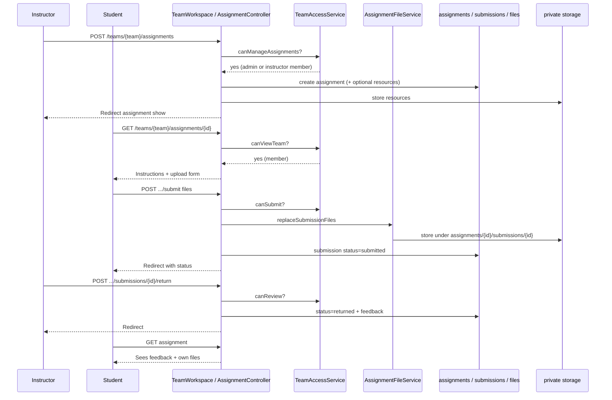

# Phase 4, Epic 1 — Team Assignments

## Summary

Microsoft Teams–style file assignments live on a **team**. Instructors (on that team) or admins create assignments; students upload files; instructors review and return with feedback. Instructors manage students and assignments only for teams they belong to — not global users or courses.

SRS: [`docs/srs-team-assignments.md`](../srs-team-assignments.md)

## Sequence



## Manual QA

1. As **admin**, create Team A, add an instructor and two students (admin Teams UI).
2. Sign in as **instructor** → **Teams** → open Team A → **New assignment** (title + optional resource) → save.
3. Sign in as **student on Team A** → see Teams-style **My work** panel → upload any type (e.g. `.py`) → **Turn in**.
4. Sign in as **student not on Team A** → cannot open that assignment (403).
5. As instructor, open assignment → download student file → return with feedback.
6. As student, confirm feedback is visible; replace files while still open → status Submitted again.
7. As instructor, **Close** assignment → student upload is rejected.
8. As instructor, try `/admin/users` and `/admin/courses` → 403; **Add students** on Team A still works.
9. As admin (not required to be a team member), create an assignment on any team and review submissions.

## Data / storage checks

- Tables: `assignments`, `assignment_attachments`, `assignment_submissions`, `assignment_submission_files`, `assignment_activity_logs`.
- Files on private disk (`config('lms.assignments.disk')`, default `local` → `storage/app/private`).
- Downloads only via authorized routes (no public URLs).

## Automated tests

```bash
php artisan test --filter=TeamAssignmentTest
```
