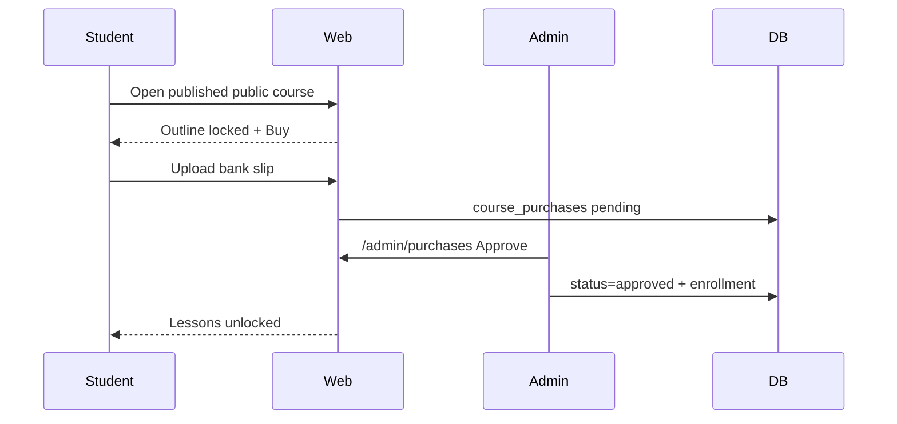
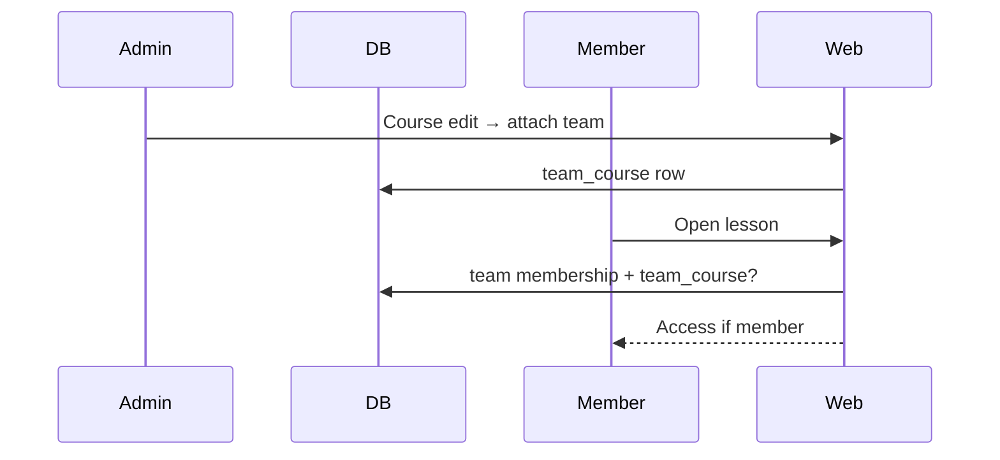

# Phase 4, Epic 2 — Course Access Model

## Goal
Split courses into **public** (bank-slip purchase → admin approve → enrollment) and **private** (grant to person and/or team only). Catalog and course pages use a Laracasts-style outline: always show the curriculum; lock rows without access. No trailers and no “contact admin” copy.

## Access rule

```
canAccess(user, course) =
  admin
  OR enrollment row
  OR member of any team linked via team_course
```

Implemented in `LessonAccessService::canAccessCourse` and used by `EnsureEnrolledInCourse`, course show unlock, and dashboard.

## Data

| Table / columns | Purpose |
| --- | --- |
| `courses.access_type` | `public` \| `private` (default `private`) |
| `courses.price_mmk` | Required when public; never shown for private |
| `courses.is_listed` | Private can be unlisted (404 for strangers) |
| `team_course` | Live team grant (approved members) |
| `course_purchases` | Slip upload queue: pending / approved / rejected |
| `enrollments` | Individual grant + approved purchases |

## Sequences

### Public buy → approve



### Private team grant



## Manual test plan

1. Migrate: `php artisan migrate`
2. Set bank fields in `.env` (`LMS_BANK_*`) or leave empty for form without account lines.
3. **Public course**
   - Admin → Courses → create/edit: Access = Public, Price = 10000, Published, Listed.
   - Guest opens course: outline locked, **Sign in to buy**.
   - Student uploads slip → sees **Purchase pending.**
   - Admin → Purchases → View slip → Approve → student can open lessons.
4. **Private listed**
   - Access = Private, Listed on. Catalog shows **Private** badge, no price.
   - Course page: outline locked, **no** Buy / contact CTA.
   - Grant via user enrollments **or** attach team on course edit → member unlocks.
5. **Private unlisted**
   - Listed off: stranger / non-granted user gets **404**; not on catalog.
   - Enrolled user can still open the course page and lessons.
6. Reject a pending purchase: student stays locked; can submit again only after no pending (current: one pending blocks another).
7. Dashboard lists courses from enrollment **or** team grant.

## Out of scope
Auto payment gateway, trailers, free preview lessons, coupons, certificates, “contact admin” messaging.
