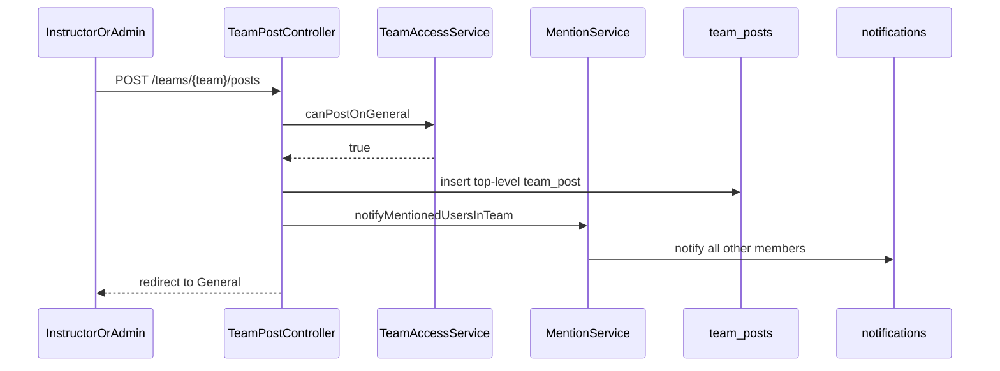
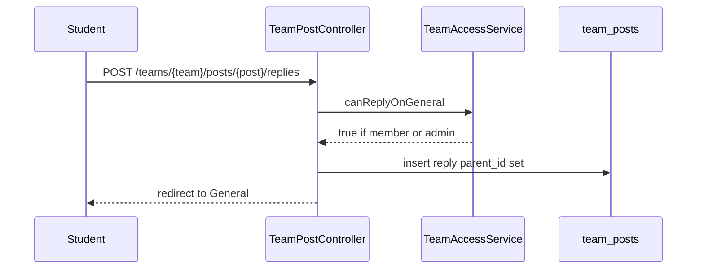

# Phase 4, Epic 2 - Team General Posts

## Summary

Team workspace pages use the same learner navbar as the rest of the LMS. The team **General** channel is a feed: instructors and admins create posts; any team member (including students) can reply. `@handle` and `@all` send database notifications to **that team’s members only**.

---

## Sequence: Staff post with @all



---

## Sequence: Student reply



---

## Manual test checklist

### A. Navbar on team pages

1. Log in as student or instructor.
2. Open a team (Assignments or General).
3. **Expect:** Browse, Forum, Teams, Dashboard, Notifications, Profile (and Admin panel for admins).

### B. Staff post / student reply

1. Instructor (on the team) opens General, writes a post, submits.
2. **Expect:** Post appears; student cannot see a top-level Post composer (or submit is 403).
3. Student replies on that post.
4. **Expect:** Reply appears under the post.

### C. Mentions

1. Instructor posts `Hello @all`.
2. **Expect:** Every other team member gets a notification; the author does not.
3. Instructor posts `Hi @studenthandle`.
4. **Expect:** That student is notified; a user not on the team is not, even if their handle appears.

### D. Access

1. User not on the team opens General URL.
2. **Expect:** 403.

---

## Database checks

```sql
SELECT id, team_id, user_id, parent_id, body FROM team_posts ORDER BY id;
SELECT * FROM notifications WHERE data LIKE '%team_post%';
```
