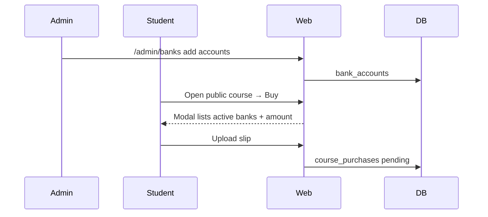
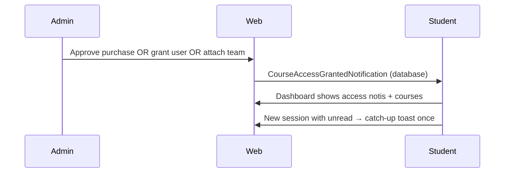

# Phase 4, Epic 3 — Course commerce UX + alerts + rich content + access notifications

## Goal
Improve public-course buying (multi bank accounts + Buy modal), course cover + rich HTML description, a global clean alert system, and notify learners when they receive access (purchase / person grant / team grant), including a once-per-session unread catch-up toast.

## Sequences

### Buy with banks

### Access notification

## Manual test plan

1. `php artisan migrate` and `php artisan storage:link`
2. Admin → **Bank accounts**: add 2 active accounts.
3. Course edit: set Public + price, upload cover, write bold/list description in Quill, save.
4. Student opens course: cover + HTML description; **Buy** opens modal with both banks; submit slip.
5. Admin approves purchase → student gets notification; course on dashboard.
6. Grant private course on user page → notification.
7. Attach team on course → team members get notification.
8. Log out/in (new session) with unread notis → toast + “View notification” chip once; refresh should not repeat until session ends.
9. Flash status messages use ProtechAlert toast (not old green banner).

## Out of scope
Full marketing sidebar from mockup, certificates, auto payment gateway.
