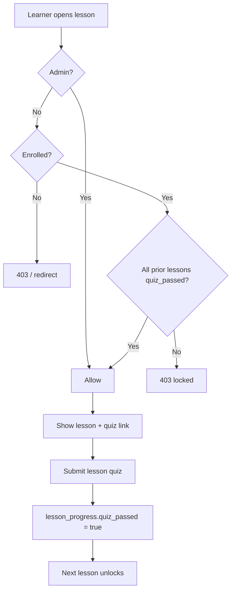

# Version 1 Technical Design and Task Breakdown

## Protech Learning System — Version 1

### Purpose

This document is the technical source of truth for Protech LMS Version 1. It describes the architecture, data model, services, routes, and epic-level tasks.

Most of Version 1 is already implemented. Epics are marked **Complete**, **Partial**, or **Pending** so AI and human developers can continue work without re-discovering the codebase.

### Source Inputs

- PRD: `docs/protech-learning-system-prd.md`
- AI workflow rules: `.cursorrules`
- Skills: `skills/generate-prd.md`, `skills/pest-testing.md`, `skills/security-checking.md`, `skills/code-review/SKILL.md`
- Current app: Laravel 13, Blade, Tailwind CSS 4, Vite, Alpine.js
- Sample docs in `sample/docs/` are reference templates only (clinic project); not runtime source of truth.

---

## 1. Technical Design

### 1.1 Architecture Goals

- Keep learning path logic (`LessonAccessService`) separate from grading (`QuizGradingService`) and logging (`ActivityLogger`).
- Use middleware for coarse access control; services for business rules.
- Store progress in `lesson_progress.quiz_passed` as the gating source of truth.
- Quiz grading runs in database transactions.
- One migration per table; one dedicated seeder per model.
- Deliver work epic-by-epic; generate `docs/flows/[feature]-sequence.md` after each epic.

### 1.2 Domain Modules

#### Identity & Access

Owns users, roles, approval, profiles.

Responsibilities:

- Registration with profile creation.
- Login/logout with approval redirect.
- Role enum and middleware.
- Public and editable profiles.

Namespace: `App\Models`, `App\Http\Middleware`, `App\Http\Controllers\Auth`

#### Catalog

Owns courses, modules, lessons, enrollments.

Responsibilities:

- Public course listing and detail.
- Admin CRUD for course structure.
- Enrollment checks.
- Course completion metrics.

Namespace: `App\Models`, `App\Http\Controllers`, `App\Http\Controllers\Admin`

#### Learning Path

Owns sequential gating and progress.

Responsibilities:

- Determine accessible lesson IDs.
- Enforce prior-lesson quiz completion.
- Module quiz eligibility.
- Completion and accuracy percentages.

Namespace: `App\Services\LessonAccessService`

#### Assessment

Owns question bank, quizzes, attempts, grading.

Responsibilities:

- MCQ question bank CRUD.
- Lesson and module quiz management.
- Grade attempts; update `lesson_progress`.

Namespace: `App\Services\QuizGradingService`, `App\Http\Controllers\Admin\QuestionBankController`

#### Community

Owns forums, lesson comments, mentions.

Responsibilities:

- Forum threads and nested posts.
- Lesson Q&A comments.
- @mention parse and notify.
- Post rate limiting.

Namespace: `App\Services\MentionService`, `App\Services\ForumPostRateLimiter`

#### Media

Owns video driver abstraction.

Responsibilities:

- YouTube embed generation.
- R2/S3 signed URL playback.
- Config-driven default driver.

Namespace: `App\Services\Video`

#### Monitoring

Owns append-only activity logs.

Responsibilities:

- Log learner and forum events.
- Admin filtered views.

Namespace: `App\Services\ActivityLogger`, `App\Http\Controllers\Admin\MonitoringController`

### 1.3 Application Structure

```text
app/
  Enums/
    UserRole.php
  Http/
    Controllers/
      Auth/
      Admin/
      ...
    Middleware/
      EnsureUserIsApproved.php
      EnsureUserRole.php
      EnsureEnrolledInCourse.php
  Models/
    User.php, Profile.php, Course.php, Module.php, Lesson.php
    Enrollment.php, LessonProgress.php
    Question.php, QuestionOption.php, Quiz.php, QuizAttempt.php, AttemptAnswer.php
    ForumCategory.php, ForumThread.php, ForumPost.php, Tag.php, LessonComment.php
    LessonActivityLog.php, QuizActivityLog.php, ForumActivityLog.php, CourseActivityLog.php
  Services/
    LessonAccessService.php
    QuizGradingService.php
    ActivityLogger.php
    MarkdownRenderer.php
    MentionService.php, MentionRenderer.php
    ForumPostRateLimiter.php
    Video/VideoDriverFactory.php, YoutubeVideoDriver.php, R2VideoDriver.php
  Notifications/
    UserMentionedNotification.php
config/
  lms.php
database/
  migrations/   (one file per table)
  seeders/      (separate seeder per domain)
resources/views/
  layouts/learn.blade.php, layouts/admin.blade.php
  courses/, lessons/, quizzes/, forums/, admin/, auth/
routes/
  web.php
tests/
  Feature/
skills/
  generate-prd.md, pest-testing.md, security-checking.md, code-review/
```

### 1.4 Core Data Model

#### `users`

- `id`, `name`, `email`, `password`, `role` (enum: admin, instructor, student)
- `approved_at`, `approved_by_user_id`, `email_verified_at`
- timestamps

#### `profiles`

- `id`, `user_id`, `handle` (unique, route key), `display_name`, `bio`
- `avatar_path`, `social_links` (JSON) — fields exist; profile form does not edit them yet

#### `courses`

- `id`, `title`, `slug` (unique, route key), `description`, `is_published`
- timestamps

#### `modules`

- `id`, `course_id`, `sort_order`, `title`
- timestamps

#### `lessons`

- `id`, `module_id`, `sort_order`, `title`
- `video_driver` (youtube|r2), `video_ref`, `duration_seconds`
- `documentation_markdown`
- timestamps

#### `enrollments`

- `id`, `user_id`, `course_id` — unique (`user_id`, `course_id`)

#### `lesson_progress`

- `id`, `user_id`, `lesson_id`
- `last_position_seconds`, `started`, `watched`, `quiz_passed`, `last_checkpoint_at`
- Gating uses `quiz_passed` only

#### `questions` / `question_options`

- Question: `technology`, `topic`, `body`, `type` (default `mcq`)
- Option: `body`, `is_correct`, `sort_order`

#### `quizzes`

- `lesson_id` (nullable) OR `module_id` (nullable) — exactly one scope
- `title`, `pass_threshold_percent`
- Many-to-many `questions` via `quiz_questions` with `sort_order`

#### `quiz_attempts` / `attempt_answers`

- Attempt: `user_id`, `quiz_id`, `score_percent`, `passed`
- Answer: `question_id`, `selected_option_id`, `is_correct`

#### Forum tables

- `forum_categories`, `tags`, `forum_threads`, `forum_thread_tag`, `forum_posts` (with `parent_id`)
- `lesson_comments` (with `parent_id`)

#### Activity log tables

- `lesson_activity_logs`, `quiz_activity_logs`, `forum_activity_logs`, `course_activity_logs`
- Each stores `user_id`, `event_type`, `occurred_at`, domain FKs, optional `meta` JSON

#### `notifications`

- Laravel database notifications table

### 1.5 Sequential Gating Design

Service: `App\Services\LessonAccessService`

Course order: `Course::orderedLessons()` — modules by `sort_order`, lessons by `sort_order` within each module.

Rules:

1. First lesson in order: accessible when enrolled (or admin).
2. Lesson N (N > 0): accessible when lessons 0..N-1 have `lesson_progress.quiz_passed = true`.
3. Lesson without a lesson quiz: never completes → blocks all downstream lessons.
4. Module recap quiz: all lessons in module must be complete; pass threshold applies on submit.
5. Lesson quiz submit: any submission sets `quiz_passed = true` (see `QuizGradingService`).




### 1.6 Quiz Grading Design

Service: `App\Services\QuizGradingService`

Flow (inside `DB::transaction`):

1. Create `QuizAttempt`.
2. Grade each question; store `AttemptAnswer` rows.
3. Calculate `score_percent`.
4. If lesson quiz: `passed = true` always.
5. If module quiz: `passed = score >= pass_threshold_percent`.
6. If lesson quiz: upsert `LessonProgress` with `quiz_passed = true`, `started = true`, `watched = true`.

### 1.7 Video Driver Design

Factory: `VideoDriverFactory` resolves `youtube` or `r2` per lesson.

Config (`config/lms.php`):

```php
'video' => [
    'default_driver' => env('DEFAULT_VIDEO_DRIVER', 'youtube'),
    'r2_disk' => env('LMS_VIDEO_R2_DISK', 's3'),
    'signed_url_ttl' => env('LMS_VIDEO_SIGNED_URL_TTL', 3600),
    'youtube' => ['use_nocookie' => env('YOUTUBE_EMBED_USE_NOCOOKIE', true)],
],
'forum' => ['max_posts_per_day' => env('LMS_FORUM_MAX_POSTS_PER_DAY', 5)],
```

### 1.8 Middleware & Authorization


| Middleware               | Alias             | Behavior                                            |
| ------------------------ | ----------------- | --------------------------------------------------- |
| `EnsureUserIsApproved`   | `approved`        | Admins pass; others need `approved_at`              |
| `EnsureUserRole`         | `role`            | 403 unless role matches (e.g. `role:admin`)         |
| `EnsureEnrolledInCourse` | `enrolled.course` | Admins pass; others need enrollment for lesson/quiz |


No Laravel Policies yet. Controllers call services for fine-grained checks.

### 1.9 Routes Summary

```text
Public:     /, /courses, /courses/{course}, /u/{handle}
Guest:      /register, /login
Auth:       /logout, /approval/pending
Learner:    /dashboard, /profiles/*, /notifications/*, /forums/*
Enrolled:   /lessons/{lesson}, /quizzes/{quiz}, /quizzes/{quiz}/attempts/{attempt}
Admin:      /admin/* (dashboard, users, courses, lessons, quizzes, questions, forums setup, monitoring)
```

**Unwired:** `CourseCatalogController::enroll()` — no route.

### 1.10 UI Layouts

- **Learner:** `layouts/learn.blade.php` — dark theme, nav: Browse, Forum, Dashboard, Notifications, Profile
- **Admin:** `layouts/admin.blade.php` — sidebar CMS

### 1.11 Testing Strategy

Per `skills/pest-testing.md`:

- Feature tests for auth, gating, quiz admin, monitoring, password, question bank.
- Add tests for each new epic before marking complete.
- Security: CSRF, validation, role checks per `skills/security-checking.md`.

Existing tests:

- `RegistrationTest`, `PasswordChangeTest`, `LessonSequenceGatingTest`
- `StudyMonitoringTest`, `AdminUserDeleteTest`
- `AdminLessonQuizManagementTest`, `QuestionBankAdminTest`

### 1.12 Key Risks & Decisions


| Risk                              | Decision                                      |
| --------------------------------- | --------------------------------------------- |
| Learners skip lessons             | Gate on `quiz_passed`, not video watch        |
| Lesson without quiz blocks course | Admin must attach lesson quiz before publish  |
| Orphan `StudyEvent` model/logger  | Remove or wire in Phase 6                     |
| Instructor role unused            | Defer to Phase 6 unless product needs it      |
| No Policies                       | Acceptable for V1; add if authorization grows |


---

## 2. Version 1 Task Breakdown

### Epic 1: Project Foundation — **Complete**


| Task                               | Status | Acceptance Criteria                                               |
| ---------------------------------- | ------ | ----------------------------------------------------------------- |
| 1.1 Laravel baseline               | Done   | App boots; migrations run; Vite builds                            |
| 1.2 Auth (register, login, logout) | Done   | Session auth works; logout invalidates session                    |
| 1.3 Roles & middleware             | Done   | `UserRole` enum; `role`, `approved`, `enrolled.course` middleware |
| 1.4 Admin approval                 | Done   | Pending users blocked; approve/revoke from admin                  |


### Epic 2: Profiles & Catalog — **Complete**


| Task                 | Status  | Acceptance Criteria                             |
| -------------------- | ------- | ----------------------------------------------- |
| 2.1 Profiles         | Done    | Handle, display name, bio; public `/u/{handle}` |
| 2.2 Course catalog   | Done    | Published courses public; progress for enrolled |
| 2.3 Admin enrollment | Done    | Sync courses on user admin page                 |
| 2.4 Self-enrollment  | Pending | Wire `enroll()` route + UI if product approves  |


### Epic 3: Course Content Admin — **Partial**


| Task                      | Status  | Acceptance Criteria                      |
| ------------------------- | ------- | ---------------------------------------- |
| 3.1 Course CRUD           | Done    | Create, edit, delete, publish flag       |
| 3.2 Module add/delete     | Done    | Append sort order; delete module         |
| 3.3 Lesson create/edit    | Done    | YouTube and R2 fields; markdown docs     |
| 3.4 Module/lesson reorder | Pending | Drag-sort or manual sort_order UI        |
| 3.5 Lesson delete         | Pending | Admin delete with progress cleanup rules |


### Epic 4: Video & Lesson Player — **Complete**


| Task                  | Status  | Acceptance Criteria                         |
| --------------------- | ------- | ------------------------------------------- |
| 4.1 YouTube driver    | Done    | Embed via `YoutubeVideoDriver`              |
| 4.2 R2 signed URLs    | Done    | `R2VideoDriver` + S3 disk config            |
| 4.3 Markdown docs     | Done    | `MarkdownRenderer` on lesson page           |
| 4.4 Playback progress | Pending | Update `last_position_seconds` during watch |


### Epic 5: Assessment & Gating — **Partial**


| Task                        | Status  | Acceptance Criteria                               |
| --------------------------- | ------- | ------------------------------------------------- |
| 5.1 Question bank           | Done    | CRUD, search, filter, pagination                  |
| 5.2 Lesson quiz admin       | Done    | Create, edit, destroy; resets progress on destroy |
| 5.3 Module quiz create      | Done    | Create/store module recap quiz                    |
| 5.4 Module quiz edit/delete | Pending | Full CRUD like lesson quizzes                     |
| 5.5 Sequential gating       | Done    | `LessonSequenceGatingTest` passes                 |
| 5.6 Quiz grading            | Done    | Transactional; lesson vs module pass rules        |


### Epic 6: Community — **Complete**


| Task                | Status | Acceptance Criteria                     |
| ------------------- | ------ | --------------------------------------- |
| 6.1 Forums          | Done   | Categories, threads, nested posts, tags |
| 6.2 Lesson comments | Done   | Threaded comments on lesson page        |
| 6.3 Mentions        | Done   | `@handle` → `UserMentionedNotification` |
| 6.4 Rate limiting   | Done   | `ForumPostRateLimiter` + config         |


### Epic 7: Administration & Monitoring — **Partial**


| Task                    | Status  | Acceptance Criteria                              |
| ----------------------- | ------- | ------------------------------------------------ |
| 7.1 User admin          | Done    | Approve, revoke, role, courses, password, delete |
| 7.2 Activity monitoring | Done    | Unified + filtered logs; per-user view           |
| 7.3 Forum setup         | Partial | Create categories/tags only; no edit/delete      |
| 7.4 Notifications inbox | Done    | List, read, mark all read                        |


### Epic 8: Seeding & Demo Content — **Complete**


| Task                      | Status | Acceptance Criteria                                |
| ------------------------- | ------ | -------------------------------------------------- |
| 8.1 DatabaseSeeder        | Done   | Admin, profile, forum category, tags (idempotent)  |
| 8.2 HTML course bootstrap | Done   | `HtmlCourseBootstrapSeeder` — 14 lessons + quizzes |


### Epic 9: QA, Security & Documentation — **In Progress**


| Task                     | Status  | Acceptance Criteria                                      |
| ------------------------ | ------- | -------------------------------------------------------- |
| 9.1 Core Pest tests      | Partial | Gating, registration, quiz admin covered; forums pending |
| 9.2 Security review      | Pending | Run `skills/security-checking.md` checklist              |
| 9.3 PRD & technical docs | Done    | This file + `protech-learning-system-prd.md`             |
| 9.4 Flow sequence docs   | Pending | Generate `docs/flows/`* per completed epic               |
| 9.5 Orphan cleanup       | Pending | Remove or implement `StudyEvent` / `StudyEventLogger`    |
| 9.6 Password reset       | Removed | Admin resets passwords; no self-service forgot-password |


---

## 3. Version 1 Completion Criteria

Version 1 is complete when:

- [x] Users register and await admin approval before learning.
- [x] Admins manage users, courses, lessons, quizzes, and question bank.
- [x] Enrolled learners follow sequential lesson gating via quiz submission.
- [x] Forums and lesson comments work with mentions and rate limits.
- [x] Activity monitoring captures lesson, quiz, forum, and course events.
- [ ] Remaining partial items resolved or explicitly deferred (see Epic 3, 5, 7, 9).
- [ ] Core Pest suite expanded for forums, approval, and module quizzes.
- [ ] `docs/flows/` sequence documents exist for critical paths.

---

## 4. Remaining Work → Phase 2

All incomplete V1 items moved to **Phase 2**: `docs/phase-2-technical-design-and-tasks.md`.

| V1 gap | Phase 2 epic |
|--------|----------------|
| Lesson delete | Epic 2 |
| Module/lesson reorder | Epic 3 |
| Module quiz edit/delete | Epic 4 |
| Video watch progress | Epic 5 |
| Avatar / social profile | Epic 6 |
| Forum admin CRUD | Epic 7 |
| ~~Password reset~~ | Removed — admin sets password on user page |
| StudyEvent cleanup | Epic 1 |
| Full Pest coverage | Epic 9 |
| Security review | Epic 10 |

**Deferred (not Phase 2):** self-enrollment, instructor role.

---

## 5. AI Workflow Reference

When continuing development:

1. Read PRD and `docs/phase-2-technical-design-and-tasks.md` before coding.
2. State **"Currently Planning: Phase 2, Epic X"** at the top of every plan.
3. Wait for user approval before writing code (plan mode).
4. One migration per table; separate seeders per model.
5. On epic completion: output **"Completed: Phase 2, Epic X"** and add `docs/flows/phase-2-epic-N-*.md`.
6. Run Pest tests; apply security and code-review skills.

