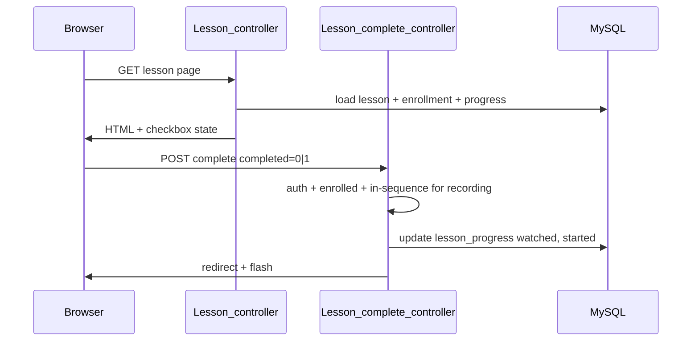
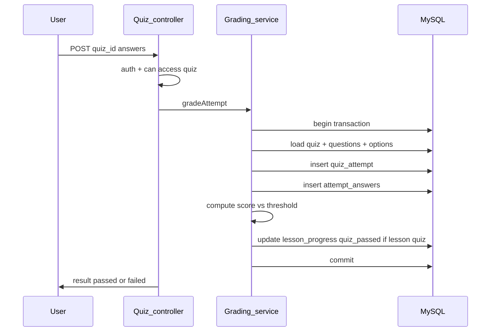
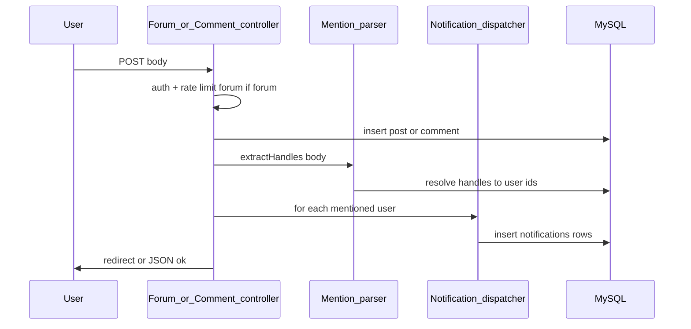

# Sequence diagrams — critical flows

Three flows that are easy to get wrong without an explicit sequence: **mark lesson complete**, **quiz attempt**, **mention**.

These sequences are **server-side and HTTP**; they are the same whether the user arrived via the **learner** or **admin** UI (admin does not change learner progress mechanics).

---

## 1. Mark lesson complete (Udemy-style checkbox)

**Goal:** Learners explicitly mark a lesson done; `lesson_progress.watched` reflects completion (no second-by-second video position tracking).

**Failure behavior:** Invalid lesson or not enrolled → **403**; out of sequence → **redirect** with flash (no `lesson_progress` write). Lesson quiz and gating still use `watched` + `quiz_passed` as before.

---

## 2. Quiz submit and grade

**Goal:** One transactional grading path; unlimited retakes until pass (store each attempt).

**Unlock interaction:** If this is a **lesson** quiz, `quiz_passed` on `lesson_progress` may gate the **next** lesson or module via **Gating** rules after commit.

---

## 3. Mention on forum post or lesson comment

**Goal:** Persist UGC, then notify mentioned users (in-app only in v1).

**Edge cases:** Self-mention (usually ignore or allow per product); invalid handles (skip silently or show validation — product choice). **Instructors** are a subset of users located by `role` or flag when building notification copy.

---

## Flow summary

| Flow | Primary tables | Critical invariant |
|------|----------------|---------------------|
| Mark complete | `lesson_progress` | User must be enrolled; in-sequence to record |
| Quiz | `quiz_attempts`, `attempt_answers` | Grade + progress update in one transaction |
| Mention | `forum_posts` / `lesson_comments`, `notifications` | Create content first, then notifications |
