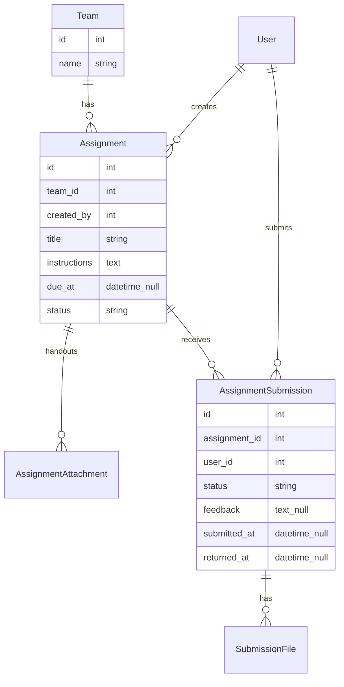

# Software Requirements Specification — Team Assignments

## Phase 4, Epic 1 — Team Assignments (SRS)

**Status:** Implemented (Phase 4, Epic 1). See [`docs/flows/phase-4-epic-1-team-assignments-sequence.md`](./flows/phase-4-epic-1-team-assignments-sequence.md).  
**Product analogy:** Microsoft Teams Classwork — file upload assignments scoped to a team.  
**Related docs:** [`protech-learning-system-prd.md`](./protech-learning-system-prd.md), Teams UX flows under `docs/flows/phase-1-teams-*-sequence.md`.

---

## 1. Purpose

Add **team-scoped file assignments**:

- An **instructor or admin** creates an assignment **inside a team**.
- **All students** on that team see it and **upload files** (including zip archives).
- The **instructor** (or admin) **reviews** submissions (view/download, mark returned, optional feedback text).

This feature is **not** course enrollment and **not** quizzes. Assignments live on the **Team**, independent of courses.

---

## 2. Scope

### In scope (v1)

- Create / edit / close / delete assignments on a team
- Instructor resource attachments on the assignment
- Per-student file submissions (upload / replace while open)
- Instructor review list, download, return with feedback
- Instructor permission to manage members and assignments **only on teams they belong to**
- Private file storage with authorized download routes
- Activity logging for create, submit, and return
- Pest feature tests for permissions and submit/return flows

### Out of scope (v1)

- Grades, rubrics, points, late penalties
- Group (single shared) submission mode
- Email / push notifications
- Linking an assignment to a course or lesson
- Plagiarism checks / Office Online preview
- Virus scanning
- Mobile app

---

## 3. Actors and permissions

| Actor | Capabilities |
| --- | --- |
| **Admin** | Create/edit/close/delete any team assignment; review any submission; manage any team's members; manage users and courses (existing powers unchanged). |
| **Instructor** | Only for **teams they belong to**: create/edit/close/delete assignments; review submissions; add/remove **students** on that team. **Cannot** manage global users, create/edit courses, or change roles. |
| **Student** | Only for **teams they belong to**: view assignments; upload/replace own submission while assignment is open; view own feedback after return. Cannot see other students' files. |

**Access rule:** membership on `team_user` is the gate for instructor and student assignment actions. Admins may act on any team without membership.

---

## 4. Functional requirements

### 4.1 Assignment lifecycle (FR-TA)

- **FR-TA1:** Admin or team instructor creates an assignment on a team with: `title` (required), `instructions` (optional plain text), `due_at` (optional), `status` (`open` \| `closed`).
- **FR-TA2:** Creator may attach **reference files** (resources) when creating or editing.
- **FR-TA3:** All **student** members of that team see the assignment list and detail while it is `open`, and see closed assignments as read-only history.
- **FR-TA4:** Closing an assignment blocks new or replacement student uploads.
- **FR-TA5:** Deleting an assignment removes its resources, submissions, and submission files (admin or instructor of that team only).
- **FR-TA6:** Submissions are **per student** (each student uploads their own work), not one shared team upload.
- **FR-TA7:** Any file type is allowed for resources and submissions (e.g. `.py`, `.html`, `.css`, `.js`, `.zip`); only count and size limits apply.

### 4.2 Student submission (FR-TS)

- **FR-TS1:** Student uploads one or more files (including `.zip`) as their submission for an open assignment.
- **FR-TS2:** One active submission per student per assignment; student may **replace** files until the assignment is **closed**.
- **FR-TS3:** Any file type is allowed (including code and archives such as `.py`, `.html`, `.css`, `.js`, `.zip`).
- **FR-TS4:** Max size per file **20 MB**; max **5 files** per submission (a zip counts as one file).
- **FR-TS5:** Student sees submission status: `not_submitted` \| `submitted` \| `returned`.
- **FR-TS6:** After instructor returns work, student can read optional **feedback text** and still download their own uploaded files.

### 4.3 Instructor review (FR-TR)

- **FR-TR1:** Instructor/admin opens an assignment and sees a list of team students with status and `submitted_at`.
- **FR-TR2:** Instructor/admin can download each student's submitted files (authorized route only).
- **FR-TR3:** Instructor/admin can mark a submission **returned** with optional feedback text (no numeric grade or rubric in v1).
- **FR-TR4:** While the assignment remains open, a student may replace files after return; status returns to `submitted` on replace. If the assignment is closed, status stays returned/read-only with no further uploads.

### 4.4 Instructor team scope (FR-TM)

- **FR-TM1:** Instructors **do not** get admin Users or Courses management.
- **FR-TM2:** Instructors **can** manage members (add/remove students) on teams they belong to.
- **FR-TM3:** Instructors **can** fully manage assignments on those teams.
- **FR-TM4:** Admin remains the only role for global user approval, role changes, and course CRUD.

---

## 5. Data model (SRS-level)

### Tables (one migration per table)

| Table | Purpose |
| --- | --- |
| `assignments` | Team assignment header |
| `assignment_attachments` | Instructor resource files |
| `assignment_submissions` | Per-student submission row |
| `assignment_submission_files` | Files belonging to a submission |

**Storage:** private disk (not public URLs). Downloads only through authorized controller routes.

---

## 6. UX surfaces (high level)

- **Team detail** (admin today; instructor for their teams): section or tab **Assignments** — list, create, open detail.
- **Assignment detail (instructor/admin):** instructions, resources, student status table, review and return actions.
- **Assignment detail (student):** Microsoft Teams–style layout — instructions/resources on the left, **My work** panel on the right (status, files, turn in).
- **Instructor entry:** My teams → team → assignments (reuse existing team detail patterns; minimal nav).

---

## 7. Non-functional requirements

- **NFR-TA1:** Authorization checked on every file download; no guessable public paths.
- **NFR-TA2:** File size and MIME/extension validation only; virus scanning out of scope for v1.
- **NFR-TA3:** Activity log events for assignment create, student submit, and instructor return (reuse existing `ActivityLogger` where practical).
- **NFR-TA4:** Pest feature tests cover: team-scoped visibility, submit/replace/close rules, instructor vs admin vs student permissions.

---

## 8. Acceptance criteria

1. Instructor on Team A creates an assignment; students on Team A see it; students on Team B do not.
2. Student uploads zip/pdf; instructor downloads and marks returned with feedback; student sees feedback.
3. Closed assignment rejects new uploads and replacements.
4. Instructor cannot use admin user/course management; can manage Team A members and assignments.
5. Admin can create, review, and manage assignments on any team.

---

## 9. Implementation gate

This document is the requirements source of truth for Phase 4, Epic 1.

**Do not expand scope** beyond this SRS without a new approved plan. Implementation shipped for Epic 1; sequence + QA: [`docs/flows/phase-4-epic-1-team-assignments-sequence.md`](./flows/phase-4-epic-1-team-assignments-sequence.md).
